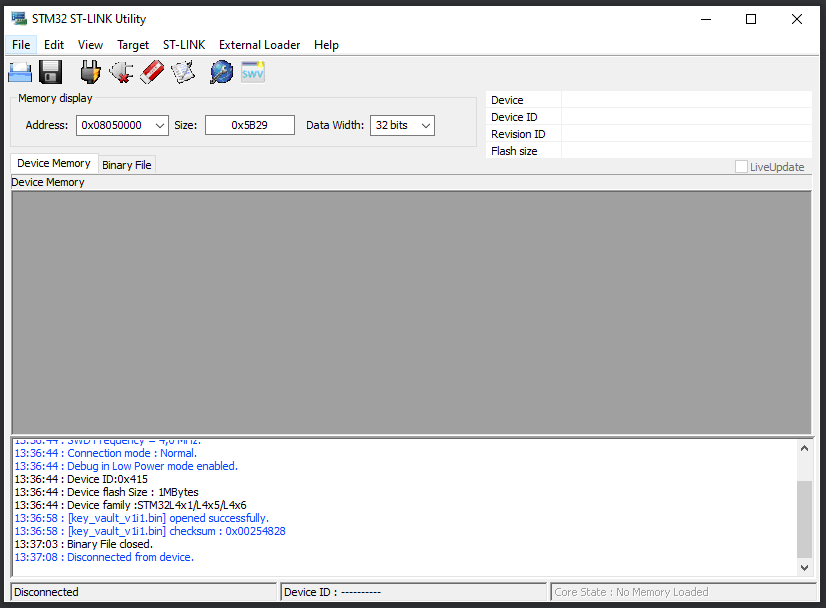
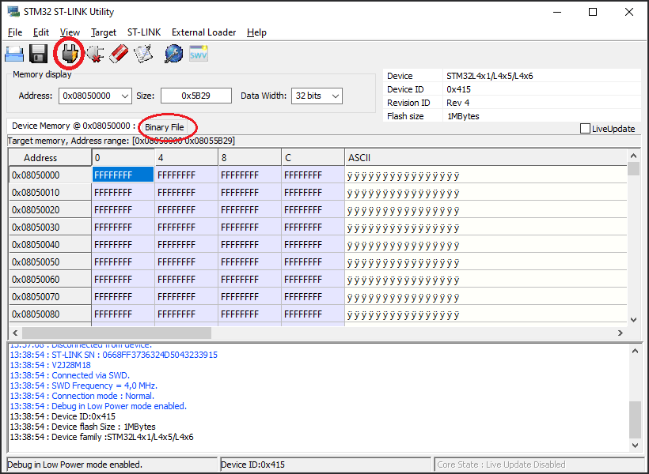
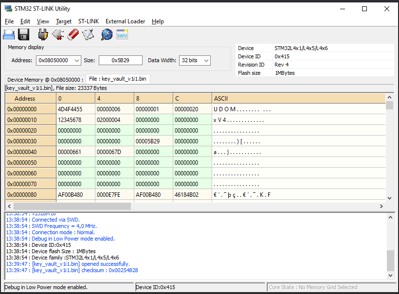
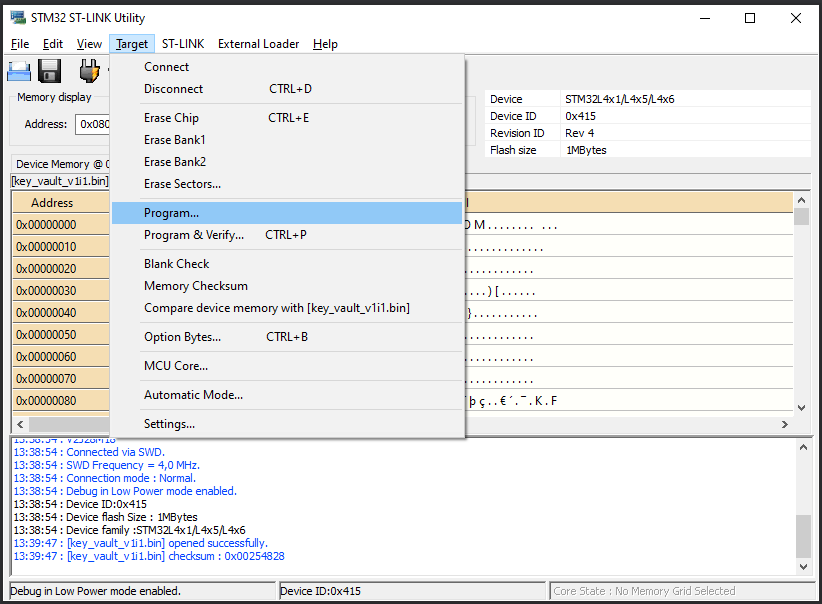

# DCF Invoke Device Method Using Azure CLI

## Prerequisites 
Please make sure you have completed the Getting Started Guide for the STM32 board and flashed the binary to your device before continuing this demo. [Instructions for STM32 Getting Started Guide](https://github.com/mamokarz/getting-started/blob/master/README.md)

## Open up an instance of Azure CLI 
You can use the Azure Portal or an instance on Powershell/bash/other local environments

Device Manager current support install code from 4 different sources.

0. **In memory**: Is the code that was brought to the memory using external interfaces (like JTag).
1. **From Blobs** (*not supported yet*): DM will download the code from Blobs using the provided URL.
2. **From CLI** (*not supported yet*): DM will copy the code from CLI to the memory.
3. **Built in**: Is the code build with the OS.

## Commands to Run 

### Built in example
The current example contains 3 packages already built in. Cypher, in 2 versions, and Sprinkler, in one version. The following commands will drive the installation, utilization and des-installation of those packages. 

<details>
<summary>Click here for Portal/bash commands</summary>
<br>

Query for existing interfaces on the device 
```
az iot hub invoke-device-method -n [name-of-iothub] -d [name-of-device] --mn "ipc_query.1.query" --mp "{}"

// expected outcome
{
  "payload": {
    "continuation_token": 655615,
    "result": [
      "ipc_query.1",
      "dm.1"
    ]
  },
  "status": 200
}

```

Install sprinker interface
```
az iot hub invoke-device-method -n [name-of-iothub] -d [name-of-device] --mn "dm.1.install" --mp "{\"source_type\":3,\"package_name\":\"sprinkler_v1i1\"}" 

// expected outcome
{
  "payload": {},
  "status": 200
}
```

Query for existing interfaces on the device. You should be able to see the newly installed sprinker.
```
az iot hub invoke-device-method -n [name-of-iothub] -d [name-of-device] --mn "ipc_query.1.query" --mp "{}"

// expected outcome
{
  "payload": {
    "continuation_token": 655615,
    "result": [
      "ipc_query.1",
      "dm.1",
      "sprinkler.1"
    ]
  },
  "status": 200
}

```

Turn on the sprinker, which will be modeled by turning on a LED on the STM Board
```
az iot hub invoke-device-method -n [name-of-iothub] -d [name-of-device] --mn "sprinkler.1.water_now" --mp "{}" 

// expected outcome
{
  "payload": {},
  "status": 200
}
```

Turn off the sprinker, which will be modeled by turning off a LED on the STM Board
```
az iot hub invoke-device-method -n [name-of-iothub] -d [name-of-device] --mn "sprinkler.1.stop" --mp "{}" 

// expected outcome
{
  "payload": {},
  "status": 200
}
```

Install the cipher package, you can query it using the IPC query command from earlier to see that it has been installed
```
az iot hub invoke-device-method -n [name-of-iothub] -d [name-of-device] --mn "dm.1.install" --mp "{\"source_type\":3,\"package_name\":\"cipher_v1i1\"}" 

// expected outcome: Azure CLI
{
  "payload": {},
  "status": 200
}

// expected outcome: serial terminal output
Receive direct method: dm.1.install
	Payload: {"package_name":"cipher_v1i1"}
Create producer for cipher v1i1...
Interface cipher 1 published with success
```

We are now sending a message to the device and using the newly installed cipher to encrypt the message "Welcome to Azure IoT!". The response will be the encrypted result of the message.
```
az iot hub invoke-device-method -n [name-of-iothub] -d [name-of-device] --mn "cipher.1.encrypt" --mp "{\"context\":0, \"src\":\"Welcome to Azure IoT\!\"}" 

// expected outcome
{
  "payload": {
    "dest": "0ZldfV1pbUhhNXhJyTkBEUhhwX2VcbRM="
  },
  "status": 200
}
```

We are now sending the result of the encrypted message back to the device to decrypt, and we should get our original message back.
```
az iot hub invoke-device-method -n [name-of-iothub] -d [name-of-device] --mn "cipher.1.decrypt" --mp "{\"src\":\"0ZldfV1pbUhhNXhJyTkBEUhhwX2Uh\"}" 

// expected outcome
{
  "payload": {
    "dest": "Welcome to Azure IoT!"
  },
  "status": 200
}
```

You can query the IPC to see which interfaces have been installed, which include the sprinkler from earlier and the cipher
```
az iot hub invoke-device-method -n [name-of-iothub] -d [name-of-device] --mn "ipc_query.1.query" --mp "{}" 

// expected outcome
{
  "payload": {
    "continuation_token": 655615,
    "result": [
      "ipc_query.1",
      "dm.1",
      "sprinkler.1",
      "cipher.1"
    ]
  },
  "status": 200
}
```

Now you can try and use a new context of the cipher interface, which would then call a different cryptography algorithm that the cipher has. However, the new context is not supported by version 1 of the cipher. It will require an update to version 2.

```
az iot hub invoke-device-method -n [name-of-iothub] -d [name-of-device] --mn "cipher.1.encrypt" --mp "{\"context\":1, \"src\":\"Welcome to Azure IoT\!\"}" 

// expected outcome
{
  "payload": {
    "description": "AZ_ERROR_NOT_SUPPORTED"
  },
  "status": 405
}
```

Now the original version 1 of the cipher can be uninstalled. An example of a real life scenario would be when a device developer discovers a bug and would need to be patched with version 2, and version 1 can be uninstalled.
```
az iot hub invoke-device-method -n [name-of-iothub] -d [name-of-device] --mn "dm.1.uninstall" --mp "{\"package_name\":\"cipher_v1i1\"}" 

// expected outcome: Azure CLI
{
  "payload": {},
  "status": 200
}

// expected outcome: serial output

Receive direct method: dm.1.uninstall
	Payload: {"package_name":"cipher_v1i1"}
Destroy producer for cipher 1.
```

You can query the IPC again and see if the package has been uninstalled

```
az iot hub invoke-device-method -n [name-of-iothub] -d [name-of-device] --mn "ipc_query.1.query" --mp "{}" 

// expected outcome : Azure CLI
{
  "payload": {
    "continuation_token": 655615,
    "result": [
      "ipc_query.1",
      "dm.1",
      "sprinkler.1"
    ]
  },
  "status": 200
}
```

Now we can install the new version of cipher with new capabilities.
```
az iot hub invoke-device-method -n [name-of-iothub] -d [name-of-device] --mn "dm.1.install" --mp "{\"source_type\":3,\"package_name\":\"cipher_v2i1\"}" 

// expect outcome: Azure CLI
{
  "payload": {},
  "status": 200
}

// expected outcome: serial terminal

Receive direct method: dm.1.install
	Payload: {"package_name":"cipher_v2i1"}
Create producer for cipher v2i1...
Interface cipher 1 published with success
```

Query IPC again to see the new version being installed
```
az iot hub invoke-device-method -n [name-of-iothub] -d [name-of-device] --mn "ipc_query.1.query" --mp "{}" 

// expected outcome
{
  "payload": {
    "continuation_token": 655615,
    "result": [
      "ipc_query.1",
      "dm.1",
      "sprinkler.1",
      "cipher.1"
    ]
  },
  "status": 200
}
```

The same functionality from version 1 still exist, and you can see that the outcome of encrypting the same string "Welcome to Azure IoT!" will do the same output of encryption.
```
az iot hub invoke-device-method -n [name-of-iothub] -d [name-of-device] --mn "cipher.1.encrypt" --mp "{\"context\":0, \"src\":\"Welcome to Azure IoT\!\"}" 

// expected outcome
{
  "payload": {
    "dest": "0ZldfV1pbUhhNXhJyTkBEUhhwX2VcbRM="
  },
  "status": 200
}
```

Now you can use the new context which would use a new alogrithm of the same string message. 
```
az iot hub invoke-device-method -n [name-of-iothub] -d [name-of-device] --mn "cipher.1.encrypt" --mp "{\"context\":1, \"src\":\"Welcome to Azure IoT\!\"}" 

// expected outcome: Azure CLI
{
  "payload": {
    "dest": "1P1xYWwQLAQ1ZCVMlAR8UDV0lXRBcNBg="
  },
  "status": 200
}

// expected outcome: serial output
Receive direct method: cipher.1.encrypt
	Payload: {"context":1,"src":"Welcome to Azure IoT\\!"}
```

You can now try the decryption method of this new encrypted message. 
```
az iot hub invoke-device-method -n [name-of-iothub] -d [name-of-device] --mn "cipher.1.decrypt" --mp "{\"src\":\"1P1xYWwQLAQ1ZCVMlAR8UDV0lXRAh\"}"

// expected outcome: Azure CLI
{
  "payload": {
    "dest": "Welcome to Azure IoT!"
  },
  "status": 200
}
// expected outcome: serial output
Receive direct method: cipher.1.decrypt
	Payload: {"src":"1P1xYWwQLAQ1ZCVMlAR8UDV0lXRAh"}
```

</details>
<br>

<details>
<summary>Click here for Powershell commands</summary>
<br>

The commands are different for Powershell because you have to use ` to escape any " double quotes

<br>

Query for existing interfaces on the device 
```
az iot hub invoke-device-method -n [name-of-iothub] -d [name-of-device] --mn "ipc_query.1.query" --mp "{}"

// expected outcome
{
  "payload": {
    "continuation_token": 655615,
    "result": [
      "ipc_query.1",
      "dm.1"
    ]
  },
  "status": 200
}

```

Install sprinker interface
```
az iot hub invoke-device-method -n [name-of-iothub] -d [name-of-device] --mn "dm.1.install" --mp "{\`"source_type\`":3,\`"package_name\`":\`"sprinkler_v1i1\`"}"  

// expected outcome
{
  "payload": {},
  "status": 200
}
```

Query for existing interfaces on the device. You should be able to see the newly installed sprinker.
```
az iot hub invoke-device-method -n [name-of-iothub] -d [name-of-device] --mn "ipc_query.1.query" --mp "{}"

// expected outcome
{
  "payload": {
    "continuation_token": 655615,
    "result": [
      "ipc_query.1",
      "dm.1",
      "sprinkler.1"
    ]
  },
  "status": 200
}

```

Turn on the sprinker, which will be modeled by turning on a LED on the STM Board
```
az iot hub invoke-device-method -n [name-of-iothub] -d [name-of-device] --mn "sprinkler.1.water_now" --mp "{}" 

// expected outcome
{
  "payload": {},
  "status": 200
}
```

Turn off the sprinker, which will be modeled by turning off a LED on the STM Board
```
az iot hub invoke-device-method -n [name-of-iothub] -d [name-of-device] --mn "sprinkler.1.stop" --mp "{}" 

// expected outcome
{
  "payload": {},
  "status": 200
}
```

Install the cipher package, you can query it using the IPC query command from earlier to see that it has been installed
```
az iot hub invoke-device-method -n [name-of-iothub] -d [name-of-device] --mn "dm.1.install" --mp "{\`"source_type\`":3,\`"package_name\`":\`"cipher_v1i1\`"}" 

// expected outcome: Azure CLI
{
  "payload": {},
  "status": 200
}

// expected outcome: serial terminal output
Receive direct method: dm.1.install
	Payload: {"package_name":"cipher_v1i1"}
Create producer for cipher v1i1...
Interface cipher 1 published with success
```

We are now sending a message to the device and using the newly installed cipher to encrypt the message "Welcome to Azure IoT!". The response will be the encrypted result of the message.
```
az iot hub invoke-device-method -n [name-of-iothub] -d [name-of-device] --mn "cipher.1.encrypt" --mp "{\`"context\`":0, \`"src\`":\`"Welcome to Azure IoT\!\`"}" 

// expected outcome
{
  "payload": {
    "dest": "0ZldfV1pbUhhNXhJyTkBEUhhwX2VcbRM="
  },
  "status": 200
}
```

We are now sending the result of the encrypted message back to the device to decrypt, and we should get our original message back.
```
az iot hub invoke-device-method -n [name-of-iothub] -d [name-of-device] --mn "cipher.1.decrypt" --mp "{\`"src\`":\`"0ZldfV1pbUhhNXhJyTkBEUhhwX2Uh\`"}" 

// expected outcome
{
  "payload": {
    "dest": "Welcome to Azure IoT!"
  },
  "status": 200
}
```

You can query the IPC to see which interfaces have been installed, which include the sprinkler from earlier and the cipher
```
az iot hub invoke-device-method -n [name-of-iothub] -d [name-of-device] --mn "ipc_query.1.query" --mp "{}" 

// expected outcome
{
  "payload": {
    "continuation_token": 655615,
    "result": [
      "ipc_query.1",
      "dm.1",
      "sprinkler.1",
      "cipher.1"
    ]
  },
  "status": 200
}
```

Now you can try and use a new context of the cipher interface, which would then call a different cryptography algorithm that the cipher has. However, the new context is not supported by version 1 of the cipher. It will require an update to version 2.

```
az iot hub invoke-device-method -n [name-of-iothub] -d [name-of-device] --mn "cipher.1.encrypt" --mp "{\`"context\`":1, \`"src\`":\`"Welcome to Azure IoT!\`"}" 

// expected outcome
{
  "payload": {
    "description": "AZ_ERROR_NOT_SUPPORTED"
  },
  "status": 405
}
```

Now the original version 1 of the cipher can be uninstalled. An example of a real life scenario would be when a device developer discovers a bug and would need to be patched with version 2, and version 1 can be uninstalled.
```
az iot hub invoke-device-method -n [name-of-iothub] -d [name-of-device] --mn "dm.1.uninstall" --mp "{\`"package_name\`":\`"cipher_v1i1\`"}" 

// expected outcome: Azure CLI
{
  "payload": {},
  "status": 200
}

// expected outcome: serial output

Receive direct method: dm.1.uninstall
	Payload: {"package_name":"cipher_v1i1"}
Destroy producer for cipher 1.
```

You can query the IPC again and see if the package has been uninstalled

```
az iot hub invoke-device-method -n [name-of-iothub] -d [name-of-device] --mn "ipc_query.1.query" --mp "{}" 

// expected outcome : Azure CLI
{
  "payload": {
    "continuation_token": 655615,
    "result": [
      "ipc_query.1",
      "dm.1",
      "sprinkler.1"
    ]
  },
  "status": 200
}
```

Now we can install the new version of cipher with new capabilities.
```
az iot hub invoke-device-method -n [name-of-iothub] -d [name-of-device] --mn "dm.1.install" --mp "{\`"source_type\`":3,\`"package_name\`":\`"cipher_v2i1\`"}" 

// expect outcome: Azure CLI
{
  "payload": {},
  "status": 200
}

// expected outcome: serial terminal

Receive direct method: dm.1.install
	Payload: {"package_name":"cipher_v2i1"}
Create producer for cipher v2i1...
Interface cipher 1 published with success
```

Query IPC again to see the new version being installed
```
az iot hub invoke-device-method -n [name-of-iothub] -d [name-of-device] --mn "ipc_query.1.query" --mp "{}" 

// expected outcome
{
  "payload": {
    "continuation_token": 655615,
    "result": [
      "ipc_query.1",
      "dm.1",
      "sprinkler.1",
      "cipher.1"
    ]
  },
  "status": 200
}
```

The same functionality from version 1 still exist, and you can see that the outcome of encrypting the same string "Welcome to Azure IoT!" will do the same output of encryption.
```
az iot hub invoke-device-method -n [name-of-iothub] -d [name-of-device] --mn "cipher.1.encrypt" --mp "{\`"context\`":0, \`"src\`":\`"Welcome to Azure IoT!\`"}" 

// expected outcome
{
  "payload": {
    "dest": "0ZldfV1pbUhhNXhJyTkBEUhhwX2VcbRM="
  },
  "status": 200
}
```

Now you can use the new context which would use a new alogrithm of the same string message. 
```
az iot hub invoke-device-method -n [name-of-iothub] -d [name-of-device] --mn "cipher.1.encrypt" --mp "{\`"context\`":1, \`"src\`":\`"Welcome to Azure IoT!\`"}" 

// expected outcome: Azure CLI
{
  "payload": {
    "dest": "1P1xYWwQLAQ1ZCVMlAR8UDV0lXRBcNBg="
  },
  "status": 200
}

// expected outcome: serial output
Receive direct method: cipher.1.encrypt
	Payload: {"context":1,"src":"Welcome to Azure IoT\\!"}
```

You can now try the decryption method of this new encrypted message. 
```
az iot hub invoke-device-method -n [name-of-iothub] -d [name-of-device] --mn "cipher.1.decrypt" --mp "{\`"src\`":\`"1P1xYWwQLAQ1ZCVMlAR8UDV0lXRAh\`"}" 

// expected outcome: Azure CLI
{
  "payload": {
    "dest": "Welcome to Azure IoT!"
  },
  "status": 200
}
// expected outcome: serial output
Receive direct method: cipher.1.decrypt
	Payload: {"src":"1P1xYWwQLAQ1ZCVMlAR8UDV0lXRAh"}
```

</details>


### In Memory example
The current example produces the key_vault_v1i1 package. The CMake will create the key_vault_v1i1.elf and key_vault_v1i1.bin for this package in ".\build\packages\key_vault_v1i1" directory. Before execute the commands bellow, you should copy the binary to the MCU internal Flash. The binary was linked to be installed in the memory 0x08050000. 

## Upload Binary to MCU Flash

### GDB Commands

One of the ways to upload the binary file is to use GDB commands.

```
restore build/packages/key_vault_v1i1/key_vault_v1i1.bin binary 0x08050000
```
and, if you are using GDB to debug your code, you can add the symbols as well. 
```
add-symbol-file build/packages/key_vault_v1i1/key_vault_v1i1.elf 0x08050080
```

### STM32 ST-Link Utility

- Locate the ST-Link Utility application. 
- If you can't locate it, refer to [Local Debugging with Visual Studio](docs/debugging-local.md) to install STLink Driver or download directly from [ST-Link Download Link](https://www.st.com/en/development-tools/stsw-link004.html) here.



- Plug the STM32 dev board to your machine. 
- Use the `Connect to the target` button to connect to your dev board and you should be able to see the content of the memory address '0x08050000'. 
- Click the `Binary File` tab and locate the `build/packages/key_vault_v1i1/key_vault_v1i1.bin` file. 



You should be able to see the content of this `.bin` package. 



Use the `Target->Program` option to choose where you want to flash the DCF package. 



- Use Starting Address as `0x08050000` and locate the `.bin` file from earlier. 
- Click `Start`. You should be able to see the package loaded into FLASH memory.


## Test the New Package
<details>
<summary>Click here for Portal/bash commands</summary>
<br>

Query for existing interfaces on the device 
```
az iot hub invoke-device-method -n [name-of-iothub] -d [name-of-device] --mn "ipc_query.1.query" --mp "{}"

// expected outcome
{
  "payload": {
    "continuation_token": 655615,
    "result": [
      "ipc_query.1",
      "dm.1"
    ]
  },
  "status": 200
}

```


Install key_vault_v1i1 package in the address 134545408 [0x08050000] 
```
az iot hub invoke-device-method -n [name-of-iothub] -d [name-of-device] --mn "dm.1.install" --mp "{\"source_type\":0,\"address\":134545408,\"package_name\":\"key_vault_v1i1\"}" 

// expected outcome
{
  "payload": {},
  "status": 200
}
```

Query for existing interfaces on the device. You should be able to see the newly installed key-vault.
```
az iot hub invoke-device-method -n [name-of-iothub] -d [name-of-device] --mn "ipc_query.1.query" --mp "{}"

// expected outcome
{
  "payload": {
    "continuation_token": 655615,
    "result": [
      "ipc_query.1",
      "dm.1",
      "key_vault.1"
    ]
  },
  "status": 200
}
```

</details>
<br>

<details>
<summary>Click here for Powershell commands</summary>
<br>

The commands are different for Powershell because you have to use ` to escape any " double quotes

<br>

Query for existing interfaces on the device 
```
az iot hub invoke-device-method -n [name-of-iothub] -d [name-of-device] --mn "ipc_query.1.query" --mp "{}"

// expected outcome
{
  "payload": {
    "continuation_token": 655615,
    "result": [
      "ipc_query.1",
      "dm.1"
    ]
  },
  "status": 200
}

```


Install key_vault_v1i1 package in the address 134545408 [0x08050000] 
```
az iot hub invoke-device-method -n [name-of-iothub] -d [name-of-device] --mn "dm.1.install" --mp "{\`"source_type\`":0,\`"address\`":134545408,\`"package_name\`":\`"key_vault_v1i1\`"}" 

// expected outcome
{
  "payload": {},
  "status": 200
}
```

Query for existing interfaces on the device. You should be able to see the newly installed key-vault.
```
az iot hub invoke-device-method -n [name-of-iothub] -d [name-of-device] --mn "ipc_query.1.query" --mp "{}"

// expected outcome
{
  "payload": {
    "continuation_token": 655615,
    "result": [
      "ipc_query.1",
      "dm.1",
      "key_vault.1"
    ]
  },
  "status": 200
}
```

</details>
<br>

## Creating Your Own Package

It is possible to create your own DCF packages and install it onto the MCU's on-chip flash storage. Use this tutorial for [How to create a DCF package](STMicroelectronics/STM32L4_L4+/create_package.md).